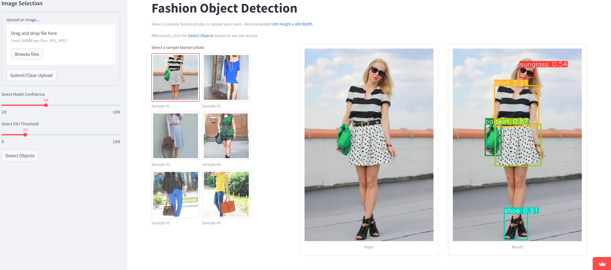

# Object Detection in Fashion: A Deep Learning Approach

This project is a part of the AAI-521 Intro to Computer Vision course in the Applied Artificial Intelligence Program at 
the University of San Diego (USD).

### <b>Project Status: Active</b>

## Streamlit Web Application

https://aai-cv-obj-detect-fashion.streamlit.app/

## Installation

To create a copy of the repository on your local device, use the following commands:

`git init`

`git clone https://github.com/jeraimondi/aai-cv-obj-detect-fashion.git`

## Project Intro

Object detection, a key aspect of computer vision, plays a pivotal role in the fashion industry. A machine learning 
model capable of detecting fashion objects can have real-world applications, such as recognizing apparel items for 
purposes related to E-Commerce, inventory management, and customer shopping experience enhancement.

## Project Objectives

* Develop a deep learning model which can obtain a minimum of:
  * Mean Average Precision (mAP) of 0.75 @IOU=50
* Develop a web application to demonstrate the model's ability to sufficiently detect fashion objects
* Experiment with multiple model architectures and techniques as a valuable learning experience

## Contributors

* [Jason Raimondi](https://github.com/jeraimondi)
* [Abdul Shariq](https://github.com/ShariqtheOne)
* [Kayla Wright](https://github.com/kaylawright26)

## Methods Used

* Computer Vision
* Machine Learning
* Deep Learning

## Technologies

* Python
* Streamlit

## Project Description

During the course, we learned about early object detection model architectures, including one-stage detectors 
(e.g., YOLO), single-shot detectors (SSDs), and two-stage detectors (e.g., R-CNN). Traditionally, there has been a 
tradeoff between having the speed of a one-stage detector or the accuracy of a two-stage detector. RetinaNet addresses 
this issue by its architecture enhancements and improvements in loss functions.

In this project, we first build initial deep learning models, both trained from scratch and also pre-trained, to obtain 
an initial understanding of the data and provide ideas for subsequent model architectures pursued. Afterwards, our 
focus shifts to the RetinaNet model architecture. We proceed to build a base RetinaNet model using a ResNet50 
convolutional backbone, followed by a second model including data augmentation, and finally a third model which 
attempts to fine-tune the second model further to determine if any performance improvements can be obtained. Being that 
more recent model architectures have been released since the introduction of RetinaNet, we also build multiple models 
using YOLOv8, which is a current state-of-the-art YOLO model architecture. Similarly, we use pre-trained models, only 
training the model top for classification and box regression for our fashion dataset and task at hand.

### Data Source

[Kaggle - Colorful Fashion Dataset For Object Detection](https://www.kaggle.com/datasets/nguyngiabol/colorful-fashion-dataset-for-object-detection)

Classes of the dataset include:
* Sunglass
* Hat
* Jacket
* Shirt
* Pants
* Shorts
* Skirt
* Dress
* Bag
* Shoe

## Acknowledgments
Thank you to all the USD professors: Dr. Albuyeh, Dr. Sadeghian, and Dr. Sardari for your continued dedication, 
guidance, and support throughout this course.

## References

Wood, L., Tan, Z., Stenbit, I., Bischof, J., Zhu, S., Chollet, F., Sreepathihalli, D., Sampath, R., & others. (2022). 
KerasCV. Retrieved from 
&nbsp;&nbsp;&nbsp;&nbsp;&nbsp;&nbsp;&nbsp;&nbsp;&nbsp;https://github.com/keras-team/keras-cv
